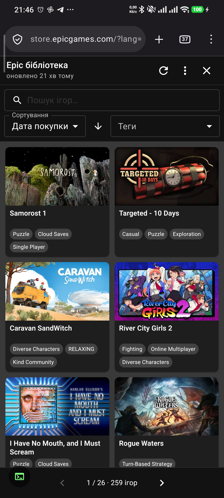
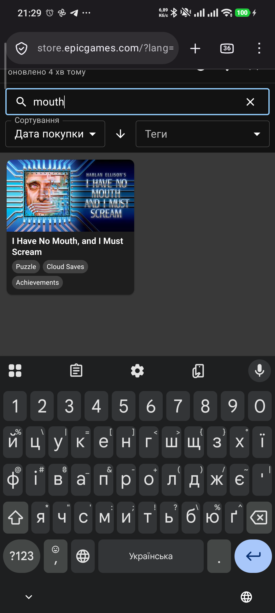
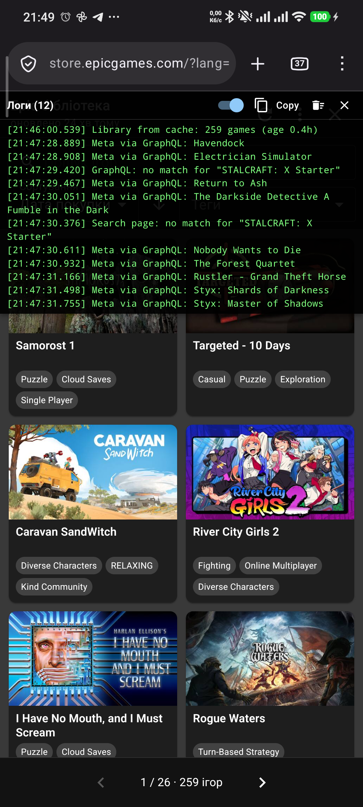
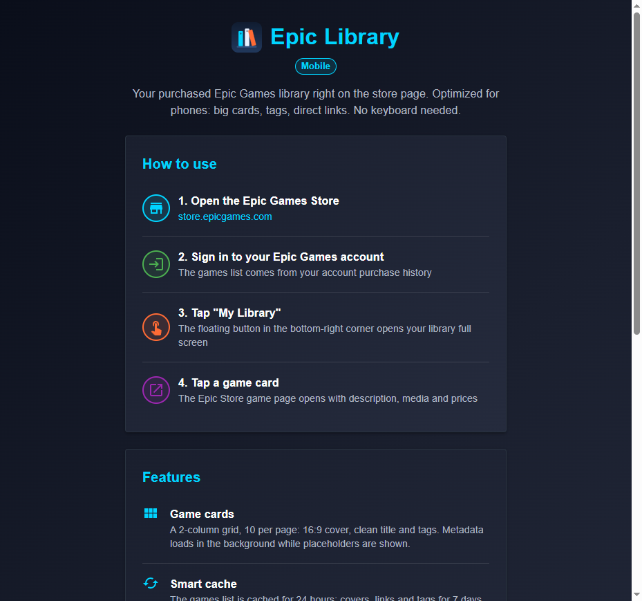

> [!IMPORTANT]
> **Note**: This extension is not officially affiliated with Epic Games, Inc.

<p align="center">
  
</p>

<h1 align="center">Epic Library Mobile</h1>

<p align="center">
  Your Epic Games library on any screen — paid games and claimed freebies alike.<br/>
  Designed for <b>Firefox on Android</b>, works on desktop too.
</p>

The Epic Games Store website has no proper "my library" page: the only workaround is digging through account transactions, with no covers, search or filters — and on a phone it is even more painful. Epic Library Mobile fixes that with a floating button right on the store pages and a touch-friendly card grid of everything you own.

## Features

- **Floating "My Library" button** on `epicgames.com` pages — no keyboard needed (desktop still has the `Alt+G` shortcut)
- **Game cards**: 2-column grid on phones, 10 per page, 16:9 covers, clean titles and tag pills
- **Direct links** — tap a card to open the game's store page with media, description and prices
- **Search, tag filter and sorting** by name, price, purchase date or release date (tapping a tag on a card filters by it)
- **Smart cache**: the games list is cached for 24 hours, covers/links/tags for 7 days
- **Bulk "add all to wishlist"** with progress and a stop option
- **On-screen log panel** with a Copy button — handy on mobile where there is no devtools console (optional, toggleable)
- **Dark and light themes**, follows the system by default
- **English and Ukrainian UI**, auto-detected from the browser language

## Screenshots

| Library | Search | Logs | Welcome |
| --- | --- | --- | --- |
|  |  |  |  |

## Installation

### Firefox Add-ons (recommended)

Install from [addons.mozilla.org](https://addons.mozilla.org/firefox/addon/epic-library-mobile/) — works in regular Firefox on Android and desktop.

### From GitHub Releases (Firefox Nightly)

Unsigned builds from [Releases](https://github.com/Nikman17/epic-library-mobile/releases) can be installed in **Firefox Nightly**:

1. Open `about:config` and set `xpinstall.signatures.required` to `false`.
2. Enable the debug menu: `Settings → About Firefox Nightly` → tap the logo 5+ times.
3. Download the `.xpi` from Releases to the phone.
4. `Settings → Install add-on from file` → pick the `.xpi`.

### Build from source

```bash
npm install
npm run zip:firefox   # → .output/epic-library-mobile-<version>-firefox.zip (ready .xpi)
npm run zip           # Chrome build
```

## Usage

1. Open [store.epicgames.com](https://store.epicgames.com) and sign in to your Epic Games account.
2. Tap the floating **My Library** button in the bottom-right corner.
3. Browse the cards, search, filter by tags, sort — tapping a card opens the game's store page.
4. The log panel toggle lives in the bottom-left corner; extras (wishlist, theme, logs) are in the ⋮ menu.

The games list is built from your account order history — both paid and free games. Nothing is sent anywhere except Epic's own services.

## Development

```bash
npm install
npm run dev:firefox   # dev mode with hot reload
npm run compile       # type check
```

Built with [WXT](https://wxt.dev), TypeScript, React and MUI.

## License

[MIT](./LICENSE)
